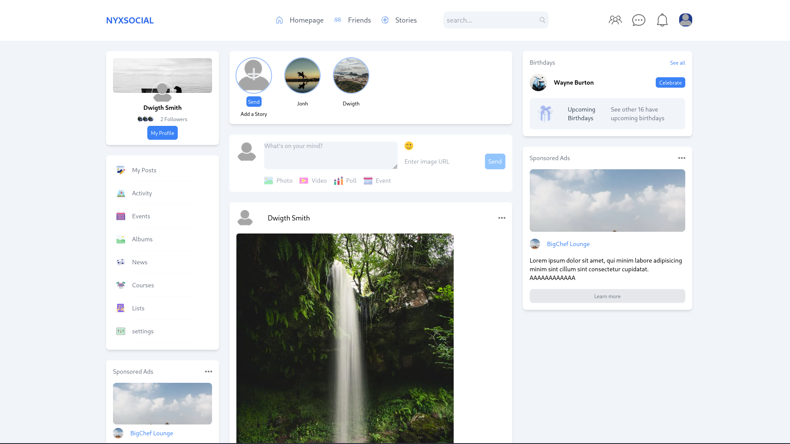

# Fullstack-social-media-java-spring

## Overview
The Fullstack Social Media project is a web application that combines Java Spring Boot for the backend and Vue 3 for the frontend. This project allows users to create profiles, connect with friends, share content, and interact in a social media environment. It demonstrates a complete full-stack development process, including user authentication, data management, and responsive UI design.
Features

*    User Authentication: Secure login and registration using JWT (JSON Web Tokens).
*    Profile Management: Users can create and update their profiles.
*    Content Sharing: Users can post updates, images, and other media.
*    Friend Connections: Users can send friend requests and manage their connections.
*    Real-time Notifications: Users receive notifications for interactions like comments and likes.
*    Responsive Design: The application is fully responsive, ensuring usability on mobile devices.

### Technologies Used

*    Frontend:
        Vue 3
        Vue Router
        Axios for API calls
        Tailwind CSS for styling
*    Backend:
        Java Spring Boot
        Spring Security for authentication
        JPA/Hibernate for database interactions
        PostgreSQL as the database
*    Development Tools:
        Docker for containerization
        Git for version control
        Maven for dependency management

### Getting Started
#### Prerequisites

    Java JDK (version 11 or higher)
    Node.js (version 14 or higher)
    Docker (optional but recommended)
    PostgreSQL database

#### Clone the Repository

```
git clone https://github.com/MatheusGh0st/fullstack-social-media-java-spring.git
cd fullstack-social-media-java-spring
```

#### Backend Setup

    Navigate to the backend directory:

    bash
    cd backend

Create a .env file in the backend directory with the following content:

```
spring.application.name=fullstack-social-media-java-spring
spring.datasource.url= jdbc:postgresql://localhost:5432/social-media-spring
spring.datasource.username=postgres
spring.datasource.password=changeme
spring.jpa.hibernate.ddl-auto=update

spring.main.allow-circular-references=true
spring.main.allow-bean-definition-overriding=true

spring.jba.properties.hibernate.jdbc.lob.non_contextual_creation=true
app.jwt.secret=
app.jwt.expiration=3600000

server.port=5000

spring.cors.allowed-origins=http://localhost:8080
spring.cors.allowed-methods=GET,POST,PUT,DELETE
spring.cors.allowed-headers=content-type
```

Build and run the Spring Boot application:

```
./mvnw spring-boot:run
```

### Frontend Setup

Navigate to the frontend directory:
```
cd client
```

### Install dependencies:

```
npm install
```

Create a .env file in the frontend directory with the following content:

```
APP_HOST=http://localhost:5000
```

### Run the Vue application:

```
npm run dev
```

Access the application at http://localhost:8080.

### Usage

    Register a new account or log in with existing credentials.
    Create your profile and start connecting with other users.
    Share posts and interact with friends through comments and likes.

### Social-Media-Page



Contributing

License

